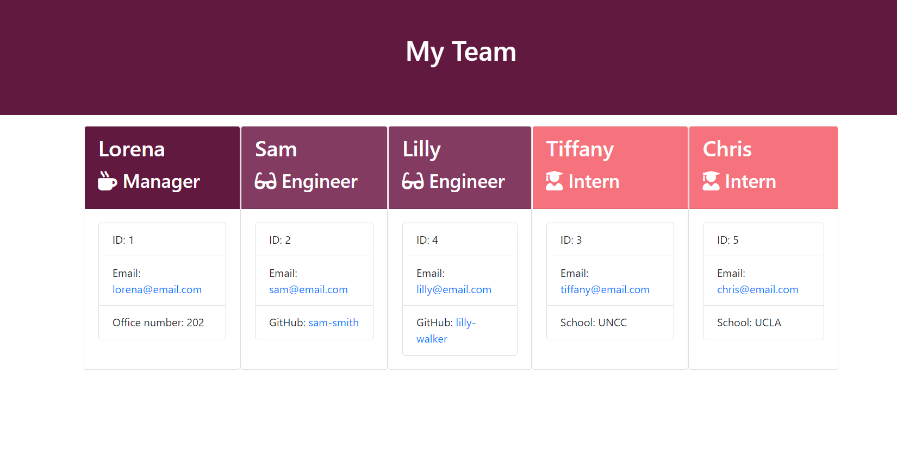

# Team-Template-Generator
## Description
  ---
  This application is dependent on Node CLI and uses the command line to take in information about employees and generates an HTML webpage that displays summaries for each person.
  
  The application will then use that data to create an html file that displays all the data retireved from the user. While creating this project it started with a base of test.js files. Classes were then created based off of the test file guidelines and were expanded upon until all test passed. This application emphasizes the uses of classes and extended classes.

  ## Table of Contents 
  --- 
  [Application](#license)

  [Installation](#installation)
  
  [Usage](#usage)
  
  [Tests](#test)

  [Questions](#Questions)

  ## Application
  ---
  * Html file generated through user input
  
  
  
  ## Installation
  ---
  * Clone source code into local computer.
  * Open file in terminal and using node.js enter npm install in the command line.

  ## Usage
  ---
  * Once you have cloned the repo open the file in terminal and enter npm install into your command line.
  * Run application using node.js and answer the following prompts about employee info.
  * Once all prompts hae been answered and the user does not wish to add anymore employees an html file will be created.
  * Navigate to the output file and open the html file created.

 ## Test
 ---
 * Open application in terminal and make sure jest is installed as a dev Dependency.
 * Enter npm run test inside the command line.

  ## Questions
  ---
  To reach me with additional questions please contact me with one of the following below.
  * My github profile - [Github Link](https://github.com/Lorena-Ramirez)
  * Email - <ramirezlorenaa18@gmail.com>

